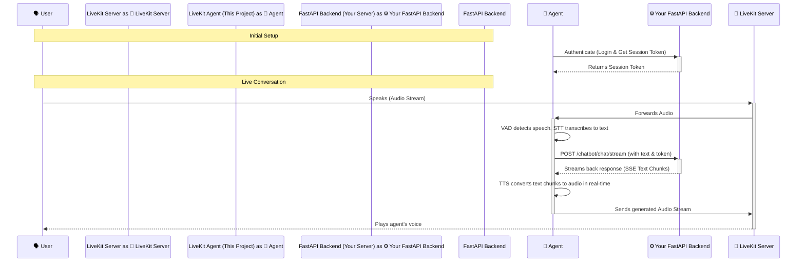

# LiveKit Voice Agent for FastAPI Backend

This project implements a real-time, full-duplex voice AI agent using **LiveKit Agents**. It is specifically designed to connect to a custom, secure **FastAPI-based LangGraph backend**, acting as a voice interface for your existing multi-agent system.

The agent handles the entire voice pipeline, from detecting when a user is speaking to transcribing their speech, streaming it to your backend, and vocalizing the response in real-time.

---

## Features

- 🗣️ **Real-Time Voice Interaction**: Low-latency, conversational AI experience.  
- 🚀 **Full-Duplex Communication**: Allows the user to interrupt the agent for a more natural conversation flow.  
- 🔒 **Custom Backend Integration**: Features a specialized adapter that handles the authentication (register, login, session) and streaming protocols of your robust FastAPI server.  
- 🎤 **Complete Voice Pipeline**:
  - **VAD**: Voice Activity Detection with Silero VAD to know when the user starts and stops speaking.  
  - **STT**: Speech-to-Text transcription using Deepgram.  
  - **TTS**: Text-to-Speech synthesis using Deepgram for a natural-sounding voice.  

---

## Architecture

The system operates by creating a bridge between the LiveKit media server and your FastAPI application. The LiveKit agent acts as the central coordinator.



## Prerequisites

Before you begin, ensure you have the following installed:

- **Python 3.11+**
- **uv**: A fast Python package installer.  
  Install with:  
  ```bash
  pip install uv
  ```
- **Docker Desktop**: Required to run the local LiveKit server.

---

## ⚙️ Setup and Installation

Follow these steps to get the project ready to run.

### 1. Configure Your Environment

Create a file named `.env` in the root of the project directory. You can copy the contents of the `.env.example` file you have. Then, fill in the required values:

```bash
# LiveKit Server Configuration
LIVEKIT_URL=ws://localhost:7880
LIVEKIT_API_KEY=devkey
LIVEKIT_API_SECRET=secret

# Your FastAPI Backend Configuration
FASTAPI_BASE_URL="http://localhost:8000/api/v1"
API_USER_EMAIL="livekit-agent@example.com"
API_USER_PASSWORD="A_Secure_Password_123_$"

# Required for Speech-to-Text
DEEPGRAM_API_KEY="YOUR_DEEPGRAM_API_KEY"
```

### 2. Install Dependencies

Use uv to create a virtual environment and install all the necessary Python packages defined in `pyproject.toml`.

```bash
uv sync
```

### 3. Download Voice Models

The agent requires pre-trained models for voice activity detection. Run the following command to download and cache them locally:

```bash
uv run python -m src.livekit_main.src.agent download-files
```

---

## ▶️ How to Run

To start the agent, you must launch three separate components in the correct order.

### Step 1: Start Your FastAPI Backend

This is your existing application. Launch it using your standard procedure. Ensure it is running and accessible at the URL you specified in the `.env` file (e.g., `http://localhost:8000`).

### Step 2: Start the LiveKit Server

For local development, you can run a LiveKit media server using Docker. You will need a `compose.yml` file (like the one from the example project you provided).

In a new terminal, navigate to the directory containing the `compose.yml` file and run:

```bash
docker compose up -d
```

### Step 3: Run the LiveKit Agent

Finally, start the voice agent. It will connect to your backend, authenticate, and then connect to the LiveKit server to wait for a user.

In a new terminal, from your project's root directory, run:

```bash
uv run python -m src.livekit_main.src.agent dev
```

You should see logs indicating a successful authentication with your API and a connection to the LiveKit room. You can now connect with a frontend client to start speaking with your agent.